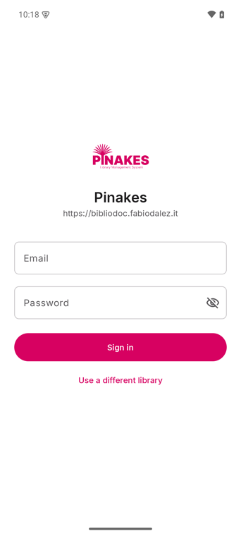
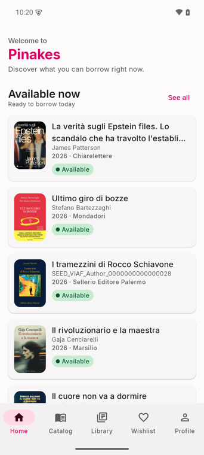
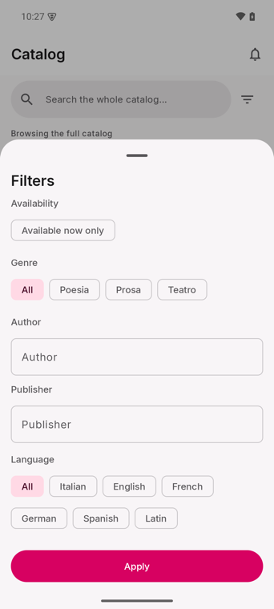
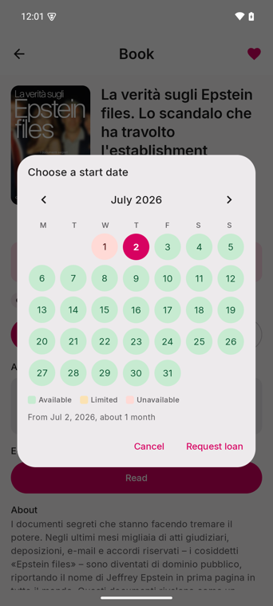
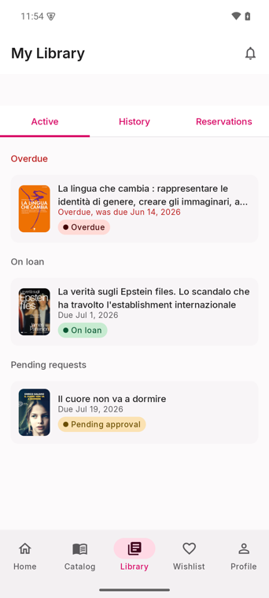
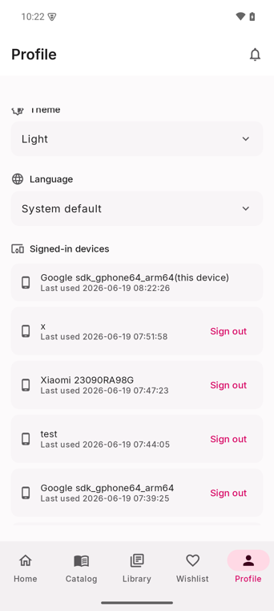

# Pinakes Android

Native Android client for a [Pinakes](https://github.com/fabiodalez-dev) library
instance. Browse the catalog, check real availability, borrow and reserve books,
read ebooks and listen to audiobooks, and manage your loans, all from your phone.


## ⬇ Download

**[Get the debug APK](https://github.com/fabiodalez-dev/pinakes-android/releases/download/v1.0.0-debug/pinakes-debug.apk)** from release `v1.0.0-debug`, then `adb install -r pinakes-debug.apk` (or open it on your phone). Point it at your Pinakes instance URL on first launch.

## What it is

A single self-contained app any Pinakes library can hand to its members. On first
launch you enter your library's web address; the app discovers the instance
through its public `/api/v1/health` endpoint, you sign in with your library
account, and from then on everything talks to that instance's REST API over a
bearer token stored in `EncryptedSharedPreferences`.

The app is server-agnostic: it works against any Pinakes instance that has the
Mobile API enabled, and it adapts to that instance's settings (language,
catalogue-only mode, push availability).

## Screenshots

<table>
  <tr>
    <td align="center"><br><sub>Login</sub></td>
    <td align="center"><br><sub>Home</sub></td>
    <td align="center"><br><sub>Catalog + filters</sub></td>
    <td align="center"><br><sub>Book detail</sub></td>
  </tr>
  <tr>
    <td align="center"><br><sub>Availability calendar</sub></td>
    <td align="center"><br><sub>My Library</sub></td>
    <td align="center"><br><sub>Profile</sub></td>
    <td></td>
  </tr>
</table>

## Features

| Area | What you get |
|------|--------------|
| **Onboarding** | Enter the instance URL, `/health` discovery card (library name, logo, HTTPS check, mobile-access check) |
| **Login** | Email/password, mapped error messages, secure token storage |
| **Home** | An "Available now" landing showing what you can borrow today |
| **Catalog** | The full catalog with infinite scroll, search, and a filter sheet (availability, genre, author, publisher, language) |
| **Book detail** | HTML-rendered description, tap-to-zoom cover, full metadata block (ISBN, year, pages …), genre chip |
| **Availability** | Colour-coded state: green available, red on loan, amber reserved |
| **Loan calendar** | Pick a start date on a calendar that paints already-booked days and pre-selects the first free day |
| **Audiobooks** | In-app player (Media3 ExoPlayer) when the title has an audio file |
| **Ebooks** | In-app PDF reader (PdfRenderer); other formats open externally |
| **My Library** | Loans grouped into Overdue / On loan / Ready & scheduled / Pending, with due dates; reservations with cancel |
| **Wishlist** | Add and remove titles |
| **Profile** | Edit profile, change password, device list, theme switcher, language switcher, logout |
| **Notifications** | Loan due/overdue, reservation ready, book available |
| **Themes** | Material 3 light and dark, light by default; pick light/dark/system in Profile |
| **Languages** | Italian, English, French, German, following the device locale or an in-app choice |

## Tech stack

- **Kotlin 2.0** + **Jetpack Compose** (Material 3), single-module app
- **Navigation-Compose** + `ViewModel`/`StateFlow`, manual DI via a `ServiceLocator`
- **Retrofit + OkHttp + kotlinx.serialization** for the `/api/v1` client (`{data, meta, error}` envelope)
- **Coil** for cover images, **Media3 ExoPlayer** for audio, platform `PdfRenderer` for PDFs
- **AndroidX Security** (`EncryptedSharedPreferences`) for the bearer token and instance URL
- compileSdk/targetSdk **35**, minSdk **26**, JDK **21** toolchain, AGP **8.7**, Gradle **8.10**
- Pinned versions in `gradle/libs.versions.toml` (no dynamic versions)

## Requirements

- JDK 21
- Android SDK with `platforms;android-35` and matching build-tools
- No Android Studio needed; the Gradle wrapper is included

## Build

```bash
./gradlew assembleDebug   # debug APK → app/build/outputs/apk/debug/app-debug.apk
./gradlew lintDebug       # static analysis
```

Create a `local.properties` with `sdk.dir=/path/to/android-sdk` (or set `ANDROID_HOME`).
Always build with the Gradle wrapper (`./gradlew`).

## Install & run

```bash
adb install -r app/build/outputs/apk/debug/app-debug.apk
```

A prebuilt debug APK is published on the [Releases](../../releases) page.

## Point it at a Pinakes instance

On first launch the app asks for the instance URL.

- Production: `https://your-library.example` (HTTPS required)
- Local emulator to host dev server: `http://10.0.2.2:8081`
- The instance must have **mobile app access enabled**, otherwise login is refused

Cleartext HTTP is only permitted for loopback and the emulator alias (`localhost`,
`127.0.0.1`, `10.0.2.2`); every other host must be HTTPS.

## Internationalization

Translations live in `i18n/{en,it,fr,de}.json` (one flat key/value map per
language; English is the source). A Gradle task generates the Android
`res/values*/strings.xml` from those JSON files at build time, so the editable
source stays in JSON and can be kept in sync with the Pinakes web locales. The
generated `strings.xml` files are git-ignored.

The app follows the device locale by default and offers an in-app language switcher
in Profile (System / Italiano / English / Français / Deutsch).

## Catalogue-only mode

If the instance runs in catalogue-only mode (`/health` reports
`catalogue_mode: true` and the matching `features.*` flags false), the app hides
loans, reservations and the wishlist: the Library and Wishlist tabs disappear and
the book detail drops its borrow/reserve actions, leaving a clean read-only
browsing experience.

## Architecture

```
app/src/main/java/com/pinakes/app/
├── data/
│   ├── model/        kotlinx.serialization models (mirror the live /api/v1 JSON)
│   ├── network/      PinakesApi (Retrofit) + interceptors
│   ├── repository/   Auth / Catalog / Library / Profile / Notifications
│   └── store/        SessionStore, FeatureStore, ThemeStore (EncryptedSharedPreferences)
├── di/               ServiceLocator
└── ui/
    ├── theme/        Color / Type / Theme (magenta #D70161 brand, light default)
    ├── components/   BookCard, AvailabilityChip, AudioPlayer, bottom bar …
    ├── navigation/   NavHost + scaffold
    └── screens/      onboarding, login, home, search, detail, library, wishlist, profile …
i18n/                 en/it/fr/de.json  (source of truth for strings)
_contract/            OpenAPI snapshot + API spec the app is built against
```

## Status

All core screens are implemented and verified end-to-end on an emulator against a
live instance (onboarding, login, catalog, detail, loans, reservations, audio, PDF,
themes, languages). UnifiedPush registration is wired in the data layer; the
distributor receiver is a follow-up. See `STATUS.md` for the full breakdown.

## License

Released under the same license as Pinakes: **AGPL-3.0**.
